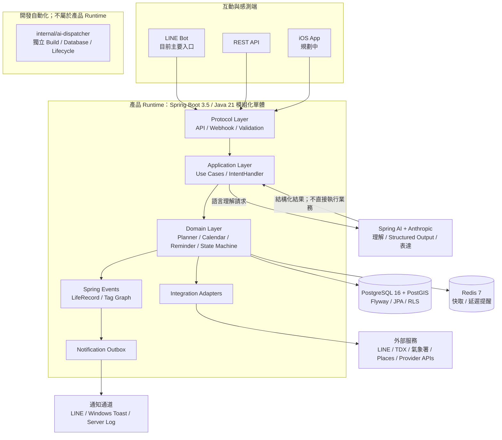

# 分身秘書（My Mobile Secretary）

一套以**情境感知、可靠提醒與確定性執行**為核心的個人秘書系統。

它不只保存待辦事項，而是嘗試把自然語言需求轉成可驗證、可追蹤的結構化任務，再結合時間、地點、行程與外部情境資料，持續判斷任務是否可行並追蹤到完成或明確結束。

> 核心優先順序：**提醒的可靠度高於提醒的聰明度。**

## 這個專案在解決什麼問題

一般聊天型 AI 很擅長理解需求，但「理解」不等於「可靠執行」。

My Mobile Secretary 將 LLM 限制在自然語言理解、Structured Output 與結果表達；真正會改變狀態的操作，仍由 Java 的 domain/application layer 驗證並執行。目標是讓 AI 能參與個人行程、提醒與生活資訊處理，同時保留後端系統需要的可測試性、權限邊界與一致性。

### 典型處理流程

```text
LINE / REST
    │
    │  自然語言需求
    ▼
Conversation / Intent
    │
    ▼
LLM
    │  Structured Output
    ▼
Typed Intent
    │
    ▼
Java Validation
    ├─ Schema
    ├─ Permission
    ├─ Time / Geo
    └─ State / Business Rules
    │
    ▼
Domain Handler
    ├─ PostgreSQL / PostGIS
    ├─ Redis
    └─ Integration Adapter
    │
    ▼
Notification Outbox
    │
    ▼
LINE / Windows Toast / Server Log
```

## 目前能力與完成度

### 已納入目前後端架構

- LINE Bot 與 REST API 作為主要互動入口。
- Spring AI + Anthropic 將自然語言轉為結構化 Intent；LLM 不直接修改業務資料。
- Calendar、Planner、Schedule、Reminder 等領域能力以 application/domain 邊界組織。
- PostgreSQL 16 + PostGIS 保存交易、行事曆、任務、知識與地理資料。
- Flyway 管理 schema 演進，並停用 Hibernate 自動更新。
- Redis 7 用於外部 API 快取與延遲提醒。
- Notification Outbox 將「通知落地」與「實際送出」解耦。
- workspace scope + PostgreSQL Row-Level Security 提供第二層資料隔離。
- JUnit 5、Spring Boot Test、Testcontainers 支援自動化測試。
- `internal/ai-dispatcher` 與產品 runtime 分離，專門處理 Codex 開發 agent 協調。

### 規劃／持續擴充

- 原生 iOS 客戶端。
- EventKit、Core Location、APNs 等 iOS 能力。
- 更多外部資料來源與可執行 Provider。
- Booking／Payment 等會造成外部狀態變更的能力，維持明確確認與安全閘門。

> README 僅將目前程式庫已建立的能力與規劃項目分開描述；更細的現況與設計決策以 `docs/` 為準。

## Engineering Highlights

### 1. LLM 與業務執行分離

LLM 只負責理解與表達，不能直接呼叫 persistence 或改變交易狀態。

```text
自然語言或圖片
      │
      ▼
LLM：理解並輸出結構化資料
      │
      ▼
Java：Schema／權限／時間／地理／狀態規則驗證
      │
      ├── 不完整或不安全 ─► 回問／拒絕／等待確認
      │
      └── 驗證通過 ──────► Domain Handler 確定性執行
                                   │
                                   ▼
                         LLM：將結果轉為自然語言
```

Intent 由 typed capability registry 與領域 `IntentHandler` 對應。新增 Intent 時，必須同步加入領域 Handler、能力目錄 `conversation-capabilities.txt` 與 regression test，降低模型輸出繞過業務規則的風險。

### 2. Modular Monolith 保留清楚邊界

系統採「薄客戶端、厚後端」與模組化單體（modular monolith）架構。Controller 處理協定與輸入輸出；application layer 編排 use case；domain layer 負責時間、地理、狀態與業務規則。

模組間優先透過明確介面及領域事件協作，而不是穿透彼此的 Web 或 persistence 實作。先保留單體部署的簡潔性，同時讓未來真的出現獨立擴縮或部署需求時，仍有可拆分的邊界。

### 3. 確定性的時間與狀態

排程、時間範圍、地理判斷與狀態機由 Java 執行，而不是交給 LLM 推測。時間相關邏輯使用可注入的 `Clock`，讓測試不依賴系統當下時間。

### 4. 資料隔離與 schema 可追溯

- Schema 僅由 Flyway migration 管理。
- `spring.jpa.open-in-view=false`。
- 受擁有權約束的資料以 `workspace_id` 區隔。
- PostgreSQL Row-Level Security 作為 application scope 之外的第二道防線。

### 5. 通知可靠性優先

通知先寫入 Notification Outbox，再交由 LINE、Windows Toast 或 server log 等通道送出，避免核心交易狀態與第三方通知通道直接耦合。

### 6. 外部 Provider 隔離

外部系統透過 `integration` adapter 隔離，domain layer 不直接依賴供應商 SDK 或 HTTP 協定。

任何會保留庫存、建立訂單、付款、變更或取消交易的操作，都必須經 application/domain service 驗證與確認；外部服務回應不直接等同於本地業務狀態。

## 專案技術架構

### 架構概覽



### 核心架構原則

- **LLM 不執行業務操作**：模型只負責自然語言理解與表達；Java 負責驗證、計算、授權與資料異動。
- **Controller 保持輕薄**：Controller 只處理協定、驗證與輸入輸出轉換，商業邏輯位於 application/domain service。
- **領域層不依賴 Web/API**：領域規則可獨立測試，不與傳輸協定或外部供應商耦合。
- **確定性的時間與狀態**：排程、時間範圍、地理判斷及狀態機由 Java 執行。
- **資料庫結構可追溯**：Schema 僅由 Flyway migration 管理。
- **工作區資料隔離**：`workspace_id` + PostgreSQL Row-Level Security。
- **事件記錄一致**：使用者可感知的領域事件接入共用 LifeRecord／tag graph recorder。

### 後端模組

主程式位於 `src/main/java/com/aproject/aidriven/mymobilesecretary`，依業務能力切分套件。各模組內再以 `api`、`application`、`domain`、`persistence` 或 adapter 邊界組織。

| 分類 | 主要模組 | 職責 |
| --- | --- | --- |
| 入口與對話 | `api`、`conversation`、`intent` | REST／LINE 協定、對話上下文、Structured Output、Intent 分派 |
| 帳號與安全 | `account`、`family`、`contact`、`safety` | workspace、actor、RLS scope、家人與聯絡人、敏感操作防線 |
| 時間與規劃 | `calendar`、`planner`、`planning`、`schedule`、`reminder` | 行事曆主資料、可行性計算、任務與提醒狀態機 |
| 個人知識 | `knowledge`、`event`、`draft`、`media` | 結構化知識、生活事件、草稿保存、私有媒體 |
| 情境能力 | `geo`、`travel`、`venue`、`schoolmeal`、`utility` | 位置、旅程、場地、學校菜單與生活資料處理 |
| 交易執行 | `booking`、`execution`、`payment` | 報價、預訂、執行與付款邊界；外部異動須經明確安全閘門 |
| 基礎設施 | `integration`、`shared`、`health` | 外部服務 adapter、共用錯誤／時間／驗證、安全與可觀測性 |

## 資料、事件與通知

- **PostgreSQL 16 + PostGIS**：保存交易型資料、行事曆、任務、知識、地理資料與 workspace scope；PostGIS 提供空間查詢。
- **Flyway**：管理所有 schema 版本與資料庫演進。
- **Spring Data JPA**：實作 persistence adapter；交易邊界由 application service 控制。
- **PostgreSQL RLS**：在 application scope 之外提供資料隔離的縱深防禦。
- **Redis 7**：處理外部 API 結果快取與延遲提醒佇列；事件匯流排目前使用 Spring Events。
- **Notification Outbox**：通知先可靠落地，再交由 server log、Windows Toast 或 LINE 通道送出。
- **LifeRecord／Tag Graph**：統一記錄通過領域規則的使用者生活事件與語意關聯。

## 外部整合

現有或規劃中的整合包括 LINE Messaging API、Anthropic、TDX、中央氣象署、Google Places，以及未來 iOS 所需的 EventKit、Core Location 與 APNs。

## 技術棧

| 層面 | 技術 |
| --- | --- |
| Runtime | Java 21、Spring Boot 3.5.x |
| AI | Spring AI 1.1.x、Anthropic、Structured Output |
| Web / Security | Spring MVC、Bean Validation、Spring Security、OAuth2 Resource Server |
| Persistence | Spring Data JPA、PostgreSQL 16、PostGIS、Flyway |
| Cache / Queue | Redis 7 |
| Observability | Spring Boot Actuator、結構化應用日誌、Git 版本資訊 |
| Test | JUnit 5、Spring Boot Test、Testcontainers |
| Local Infrastructure | Docker Compose |

## 儲存庫邊界

```text
src/                       # 產品主應用：Spring Boot 模組化單體
docs/                      # 架構、現行決策、開發計畫與測試策略
scripts/                   # 協調式開發、測試與服務生命週期工具
internal/ai-dispatcher/    # 獨立的開發自動化應用，不屬於產品 runtime
```

`internal/ai-dispatcher` 擁有獨立的 Maven build、資料庫、Flyway migration 與生命週期，只負責 Codex 開發 agent 的協調，不得成為主應用依賴。

更完整的架構原則與現行決策，請參閱 [docs/architecture.md](docs/architecture.md) 與 [docs/decisions/current.md](docs/decisions/current.md)。
