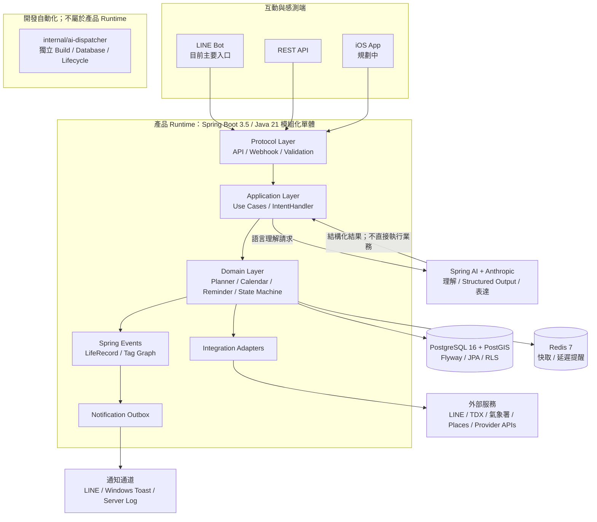

# 分身秘書（My Mobile Secretary）

一套以**情境感知、可靠提醒與確定性執行**為核心的個人秘書系統。

它不只保存待辦事項，而是嘗試把自然語言需求轉成可驗證、可追蹤的結構化任務，再結合時間、地點、行程與外部情境資料，持續判斷任務是否可行並追蹤到完成或明確結束。

> 核心優先順序：**提醒的可靠度高於提醒的聰明度。**

這個專案也記錄我如何實踐 **Agentic coding**：由我決定產品與架構邊界，透過 AI agent 分階段開發，再以雙機交接、測試與版本證據驗收。下面整理已完成的操作實績與可查證來源。

## 工程重點與驗證入口

| 問題 | 設計取捨 | 證據入口 |
| --- | --- | --- |
| LLM 輸出可能不符合可執行規則 | 模型只理解與表達；Java application/domain 驗證權限、時間、地理與狀態，再執行資料異動 | 本頁 Engineering Highlights；[架構文件](docs/architecture.md) |
| 單人維護仍需清楚的模組邊界 | 採 modular monolith、薄客戶端與 provider adapter，控制部署及整合成本 | 本頁架構與模組導覽 |
| 私人任務不能跨使用者洩漏 | workspace／actor scope 加上 PostgreSQL RLS，schema 由 Flyway 管理 | 本頁資料隔離；[測試策略](docs/test-strategy.md) |
| 核心交易與外部通知可能分別失敗 | Notification Outbox 先落地，再交付通知通道；可靠落地不等於第三方已送達 | 本頁通知可靠性與完成度 |
| 時間推進或模型調整造成回歸 | 可注入 Clock、Fast／Testcontainers／opt-in live evaluation 分層驗證 | [PR #62 的固定 Clock 修復](https://github.com/wei310129/my-mobile-secretary/pull/62)；本頁 Agentic Coding |

### AI 開發工具與責任

前期使用 **Claude Code**，並使用 **ChatGPT／Codex** 協助需求分析、方案比較、實作、重構與測試。我負責產品方向、架構與執行邊界、驗收標準及結果判斷；AI 的程式產出仍須經直接相關測試與交付品質閘門驗證。`internal/ai-dispatcher` 是隔離的開發自動化應用，不是個人秘書產品的 runtime。

下方 PR 與測試數量是特定修正的歷史證據；目前版本的通過範圍以該次報告為準。

## 這個專案在解決什麼問題

一般聊天型 AI 很擅長理解需求，但「理解」不等於「可靠執行」。

My Mobile Secretary 將 LLM 限制在自然語言理解、Structured Output 與結果表達；真正會改變狀態的操作，仍由 Java 的 domain/application layer 驗證並執行。目標是讓 AI 能參與個人行程、提醒與生活資訊處理，同時保留後端系統需要的可測試性、權限邊界與一致性。

### 示範流程：建立定時提醒

```text
LINE / REST
    │
    │  「明天下午三點提醒我買牛奶」
    ▼
Conversation / Intent
    │
    ▼
LLM
    │  Structured Output
    ▼
Typed Intent
    │
    ▼
Java Validation
    ├─ Schema
    ├─ Permission
    ├─ Time / Geo
    └─ State / Business Rules
    │
    ▼
Domain Handler
    ├─ PostgreSQL / PostGIS
    ├─ Redis
    └─ Integration Adapter
    │
    │  提醒到期，由背景 worker 處理
    ▼
Notification Outbox
    │
    ▼
LINE / Windows Toast / Server Log
```

## 目前能力與完成度

### 已實作的後端能力

| 使用情境 | 目前可以做什麼 |
| --- | --- |
| 待辦與提醒 | 透過 LINE／REST 建立、查詢、完成與調整待辦；Redis 延遲佇列處理到期提醒 |
| 行程與規劃 | Calendar、Planner、Reminder 處理行程、提醒與時間／地理可行性；Calendar v2 切換依獨立 gate 推進 |
| 購物與個人知識 | 管理購物清單、庫存與價格歷史；圖片文件先抽取，再依領域規則保存生活資訊 |
| 外部情境 | 透過 adapter 查詢天氣、交通與地點；可用性依供應商設定與資料覆蓋而定 |
| 可靠性與隔離 | Notification Outbox、workspace／actor scope、PostgreSQL RLS、Flyway 與自動化測試已納入後端 |

可以從這些語句開始：`明天下午三點提醒我買牛奶`、`購物清單加雞蛋跟牛奶`、`明天會下雨嗎`。時間、地點或上下文不足時，系統需先釐清，不能把模型的猜測當作可執行事實；完整語句契約見[對話能力目錄](src/main/resources/conversation-capabilities.txt)。

### 尚未完成或仍受驗收閘門限制

| 項目 | 狀態與邊界 |
| --- | --- |
| 原生 iOS／EventKit／Core Location／APNs／Live Activities | 規劃中；目前主要入口是 LINE Bot 與 REST API |
| Booking／Payment 真實交易 | 已有本地及 fake-provider 執行基礎；真實供應商串接、保留庫存、下單與付款尚未開放 |
| Calendar v2 完整切換與舊模型移除 | 依現行計畫分階段驗收，不以模組存在代表已完成所有 release gates |
| 進階基礎設施 | Redis Streams、Kafka、Kubernetes 與 pgvector 留待後續階段評估 |

目前完成度以[現行決策](docs/decisions/current.md)與[進行中計畫索引](docs/exec-plans/active/index.md)為準；上述能力不代表所有外部服務與客戶端均已上線。

## Agentic Coding：我如何用 AI 開發與驗收

我負責產品決策、架構邊界與驗收標準，讓 coding agent 依明確契約完成規劃、實作與測試。每個階段都要留下可 review 的分支、測試結果與交接紀錄；模型回覆「完成」仍需用工程證據確認。

### 從需求到可審查的交付

1. **先固定契約**：把產品決策、不變量、候選檔案與驗收條件寫進計畫，依 [AGENTS.md](AGENTS.md) 與任務路由載入必要 context。
2. **分階段實作**：一個 gate 對應一支從 main 建立的分支與一個 PR；限定可修改路徑，避免 agent 順手擴大範圍。
3. **用證據驗收**：先重現失敗，再跑 focused、相鄰安全測試與必要的完整回歸；交付附上命令、結果、skip 與殘餘風險。
4. **保留人的決策權**：產品行為變更、跨機交接與外部異動依各自 gate 處理；merge 必須取得當輪對精確 PR／head SHA 的授權，再重新驗證 required checks。

長時間開發的計畫也設有 context 壓縮提醒點，續作摘要保留已拍板決策、修改檔案、驗證結果、未完成工作與下一步，讓新 session 能接續已驗證的階段。

### 雙機開發：用 ownership 與 Git 交接工作

筆電與桌電各有開發 lane，分工由路徑與發布 checkpoint 約束：

| 開發 lane | 分工與交接方式 |
| --- | --- |
| 筆電 | Calendar／Travel／Conversation 與中央整合；負責發布上游契約與 schema handoff |
| 桌電 | 接手已發布的 Booking／ADD execution 契約；在自己的分支開發與驗證，依 grant 使用 migration 版本 |

跨機交接使用已 push 的 SHA、producer-owned 狀態檔與 trigger receipt；consumer 必須重新驗證 Git 與依賴狀態。同機的 Maven mutex 只協調本機資源，跨機協調另由 Git、路徑 ownership 與一次性 Flyway grant 處理。規則見[雙機計畫](docs/exec-plans/active/two-machine-parallel-development-plan.md)與[交接協定](docs/exec-plans/active/parallel-development-trigger-registry.md)。

**已發布的操作實績**：[桌電交接紀錄](docs/exec-plans/active/handoffs/desktop-trigger-state.json)保存 ADD Core 的 [PR #11／發布版本](https://github.com/wei310129/my-mobile-secretary/commit/194413cd78004494a30c6c64a7aba60c6cb525f2)，包含 focused 19、security-neighbor 29、完整回歸 1,609 tests（16 skipped），failure／error 均為 0。Booking B4-Fake 也有已合併版本、測試證據與外部異動次數 0 的紀錄。這些是各階段的歷史驗收數字；後續串接與 lane 切換仍需各自通過 gate。

### 測試驗證：從修正案例檢查到泛化與回歸

- **分層驗證**：純 Java 契約與規則跑 Fast；Spring wiring、Flyway、RLS、通知與併發由 Testcontainers integration 驗證；真實模型與外部服務另外做 opt-in live evaluation。CI 分 shard 執行並檢查 suite 是否漏測或重複，詳見[測試策略](docs/test-strategy.md)。
- **保留未參與修正的驗收案例**：對話能力以 permanent regression 與 sealed holdout 驗收，避免只符合修正時看過的語句。[Calendar Wheel 8 紀錄](docs/exec-plans/active/calendar-plan-v2-sol-medium-development-test-plan.md)包含 16 cases／19 turns 的 sealed holdout，failed 為 0。
- **失敗重現與修復實例**：[PR #62](https://github.com/wei310129/my-mobile-secretary/pull/62)曾因系統日期推進出現 3 個整合測試失敗。先在本機重現，再為這三個測試類別注入固定的 scenario `Clock`；保留原有 assertions 與正式環境的時鐘行為。修正後依序通過 3 個原失敗案例、49 個相關測試，以及本機完整回歸 1,656 tests（13 skipped、0 failure／error），並通過[該修正 SHA 的 CI](https://github.com/wei310129/my-mobile-secretary/actions/runs/36653318941)。本機 Git metadata 插件相容性問題的測試暫用參數與限制另記於[工具待辦](docs/tooling-backlog.md)，未改動 CI 設定。

### 開發環境也要有故障與交付驗證

Agent 開發會共用 Maven target、Docker、資料庫與服務生命週期。我將 repository-owned 入口接入 coordinator lease 與交接 receipt，並在隔離環境驗證競爭、失敗注入與 owner crash。[協調工具完成紀錄](docs/exec-plans/completed/development-session-coordination-pipeline.md)包含 20-process kernel 驗證、同時進入 critical section 最多 1 個程序，以及 rollout 各項 gate 的結果。

交付時也比對 checkout 與 `/actuator/info` 的完整 SHA，區分「程式碼已提交」與「服務正在運行該版本」。未經 wrapper 的 IDE／直接命令仍有偵測邊界，共用持久資料的清理也維持保守策略；這些限制與測試結果一併留下紀錄。

## Engineering Highlights

### 1. LLM 與業務執行分離

LLM 只負責理解與表達，不能直接呼叫 persistence 或改變交易狀態。

```text
自然語言或圖片
      │
      ▼
LLM：理解並輸出結構化資料
      │
      ▼
Java：Schema／權限／時間／地理／狀態規則驗證
      │
      ├── 不完整或不安全 ─► 回問／拒絕／等待確認
      │
      └── 驗證通過 ──────► Domain Handler 確定性執行
                                   │
                                   ▼
                         LLM：將結果轉為自然語言
```

Intent 由 typed capability registry 與領域 `IntentHandler` 對應。新增 Intent 時，必須同步加入領域 Handler、能力目錄 `conversation-capabilities.txt` 與 regression test，降低模型輸出繞過業務規則的風險。

### 2. Modular Monolith 保留清楚邊界

系統採「薄客戶端、厚後端」與模組化單體（modular monolith）架構。Controller 處理協定與輸入輸出；application layer 編排 use case；domain layer 負責時間、地理、狀態與業務規則。

模組間優先透過明確介面及領域事件協作，而不是穿透彼此的 Web 或 persistence 實作。先保留單體部署的簡潔性，同時讓未來真的出現獨立擴縮或部署需求時，仍有可拆分的邊界。

### 3. 確定性的時間與狀態

排程、時間範圍、地理判斷與狀態機由 Java 執行，而不是交給 LLM 推測。時間相關邏輯使用可注入的 `Clock`，讓測試不依賴系統當下時間。

### 4. 資料隔離與 schema 可追溯

- Schema 僅由 Flyway migration 管理。
- `spring.jpa.open-in-view=false`。
- 受擁有權約束的資料以 `workspace_id` 區隔。
- PostgreSQL Row-Level Security 作為 application scope 之外的第二道防線。

### 5. 通知可靠性優先

通知先寫入 Notification Outbox，再交由 LINE、Windows Toast 或 server log 等通道送出，避免核心交易狀態與第三方通知通道直接耦合。

### 6. 外部 Provider 隔離

外部系統透過 `integration` adapter 隔離，domain layer 不直接依賴供應商 SDK 或 HTTP 協定。

任何會保留庫存、建立訂單、付款、變更或取消交易的操作，都必須經 application/domain service 驗證與確認；外部服務回應不直接等同於本地業務狀態。

## 專案技術架構

### 架構概覽



### 核心架構原則

- **LLM 不執行業務操作**：模型只負責自然語言理解與表達；Java 負責驗證、計算、授權與資料異動。
- **Controller 保持輕薄**：Controller 只處理協定、驗證與輸入輸出轉換，商業邏輯位於 application/domain service。
- **領域層不依賴 Web/API**：領域規則可獨立測試，不與傳輸協定或外部供應商耦合。
- **確定性的時間與狀態**：排程、時間範圍、地理判斷及狀態機由 Java 執行。
- **資料庫結構可追溯**：Schema 僅由 Flyway migration 管理。
- **工作區資料隔離**：`workspace_id` + PostgreSQL Row-Level Security。
- **事件記錄一致**：使用者可感知的領域事件接入共用 LifeRecord／tag graph recorder。

### 後端模組

主程式位於 `src/main/java/com/aproject/aidriven/mymobilesecretary`，依業務能力切分套件。各模組內再以 `api`、`application`、`domain`、`persistence` 或 adapter 邊界組織。

| 分類 | 主要模組 | 職責 |
| --- | --- | --- |
| 入口與對話 | `api`、`conversation`、`intent` | REST／LINE 協定、對話上下文、Structured Output、Intent 分派 |
| 帳號與安全 | `account`、`family`、`contact`、`safety` | workspace、actor、RLS scope、家人與聯絡人、敏感操作防線 |
| 時間與規劃 | `calendar`、`planner`、`planning`、`schedule`、`reminder` | 行事曆主資料、可行性計算、任務與提醒狀態機 |
| 個人知識 | `knowledge`、`event`、`draft`、`media` | 結構化知識、生活事件、草稿保存、私有媒體 |
| 情境能力 | `geo`、`travel`、`venue`、`schoolmeal`、`utility` | 位置、旅程、場地、學校菜單與生活資料處理 |
| 交易執行 | `booking`、`execution`、`payment` | 報價、預訂、執行與付款邊界；外部異動須經明確安全閘門 |
| 基礎設施 | `integration`、`shared`、`health` | 外部服務 adapter、共用錯誤／時間／驗證、安全與可觀測性 |

## 資料、事件與通知

- **PostgreSQL 16 + PostGIS**：保存交易型資料、行事曆、任務、知識、地理資料與 workspace scope；PostGIS 提供空間查詢。
- **Flyway**：管理所有 schema 版本與資料庫演進。
- **Spring Data JPA**：實作 persistence adapter；交易邊界由 application service 控制。
- **PostgreSQL RLS**：在 application scope 之外提供資料隔離的縱深防禦。
- **Redis 7**：處理外部 API 結果快取與延遲提醒佇列；事件匯流排目前使用 Spring Events。
- **Notification Outbox**：通知先可靠落地，再交由 server log、Windows Toast 或 LINE 通道送出。
- **LifeRecord／Tag Graph**：統一記錄通過領域規則的使用者生活事件與語意關聯。

## 外部整合

目前後端整合包括 LINE Messaging API、Anthropic、TDX、中央氣象署與 Google Places，需依各 adapter 設定憑證。EventKit、Core Location 與 APNs 屬未來 iOS 客戶端範圍；真實交易 Provider 仍受獨立開發及外部操作閘門限制。

## 測試與工程證據

驗證入口與測試來源均可在儲存庫查閱：

| 驗證目標 | 證據入口 |
| --- | --- |
| 自然語言能力契約 | [ConversationCapabilityCatalogTest](src/test/java/com/aproject/aidriven/mymobilesecretary/intent/application/ConversationCapabilityCatalogTest.java) |
| LINE webhook 與簽章防線 | [LineWebhookApiTest](src/test/java/com/aproject/aidriven/mymobilesecretary/api/line/LineWebhookApiTest.java)、[LineSignatureVerifierTest](src/test/java/com/aproject/aidriven/mymobilesecretary/integration/line/LineSignatureVerifierTest.java) |
| Redis 到期提醒流程 | [DelayedReminderFlowTest](src/test/java/com/aproject/aidriven/mymobilesecretary/reminder/application/DelayedReminderFlowTest.java) |
| 通知持久化與交付 | [NotificationOutboxIntegrationTest](src/test/java/com/aproject/aidriven/mymobilesecretary/integration/notification/NotificationOutboxIntegrationTest.java) |
| workspace／RLS 隔離 | [WorkspaceRlsIntegrationTest](src/test/java/com/aproject/aidriven/mymobilesecretary/account/workspace/WorkspaceRlsIntegrationTest.java) |

[GitHub Actions Test gates](.github/workflows/test-gates.yml) 在 PR 執行 Fast、三個 Integration shards 與彙整 gate；整合測試使用 Testcontainers，單一 shard 內保持 serial。測試報告以該次 CI 的 Surefire artifacts 為準；真實 LLM／外部服務的 live evaluation 為另外的 opt-in 範圍。

```powershell
# 不啟動完整 Spring／Testcontainers 的快速驗證
powershell -ExecutionPolicy Bypass -File .\scripts\test.ps1 -Lane Fast

# 完整 deterministic automated regression（需要 Docker，排除 live evaluation）
powershell -ExecutionPolicy Bypass -File .\scripts\test.ps1 -Lane Full
```

測試分層與完整 gate 見[測試策略](docs/test-strategy.md)。本頁提供可重現的驗證入口；通過項目與數量需查該次執行報告。

## 技術棧

| 層面 | 技術 |
| --- | --- |
| Runtime | Java 21、Spring Boot 3.5.x |
| AI | Spring AI 1.1.x、Anthropic、Structured Output |
| Web / Security | Spring MVC、Bean Validation、Spring Security、OAuth2 Resource Server |
| Persistence | Spring Data JPA、PostgreSQL 16、PostGIS、Flyway |
| Cache / Queue | Redis 7 |
| Observability | Spring Boot Actuator、結構化應用日誌、Git 版本資訊 |
| Test | JUnit 5、Spring Boot Test、Testcontainers |
| Local Infrastructure | Docker Compose |

## 本機啟動（Windows 開發環境）

準備 JDK 21、Docker Desktop 與 PowerShell；專案附 Maven Wrapper。LINE 與 Anthropic 等憑證放在未追蹤的 `secrets.yaml`，依 `src/main/resources/application.yaml` 的設定鍵配置，勿提交至版控。完整自然語言示範需要模型憑證；LINE 互動另需 channel 設定與可由 LINE 存取的 HTTPS webhook。

```powershell
# 啟動 PostgreSQL／Redis、主服務與既有協調式開發環境
powershell -ExecutionPolicy Bypass -File .\scripts\dev-start.ps1

# 查看服務健康與 checkout／運行版本
powershell -ExecutionPolicy Bypass -File .\scripts\dev-status.ps1
```

`dev-start.ps1` 預設使用 `local` profile，管理 ngrok，並以 LINE 官方端到端 webhook 測試驗證入口。啟動成功只證明服務及 webhook 連通；上方自然語言示範仍需透過 LINE 實際驗收。[環境預檢契約](docs/agent-context/development-environment-preflight.md)說明寫入、測試與 runtime 操作的 capability gate。

## 儲存庫邊界

```text
src/                       # 產品主應用：Spring Boot 模組化單體
docs/                      # 架構、現行決策、開發計畫與測試策略
scripts/                   # 協調式開發、測試與服務生命週期工具
internal/ai-dispatcher/    # 獨立的開發自動化應用，不屬於產品 runtime
```

`internal/ai-dispatcher` 擁有獨立的 Maven build、資料庫、Flyway migration 與生命週期，只負責 Codex 開發 agent 的協調，不得成為主應用依賴。

## 路線圖與文件

- [架構與長期方向](docs/architecture.md)：產品原則、模組邊界與原始路線圖。
- [現行決策](docs/decisions/current.md)：已拍板的產品語意與工程不變量。
- [進行中計畫](docs/exec-plans/active/index.md)：Calendar、Travel、Booking 等階段與驗收閘門。
- [開發計畫與歷史](docs/development-plan.md)：階段進度、驗收結果與決策追溯。
- [測試策略](docs/test-strategy.md)：本機選測、CI gate 與 live evaluation 邊界。

